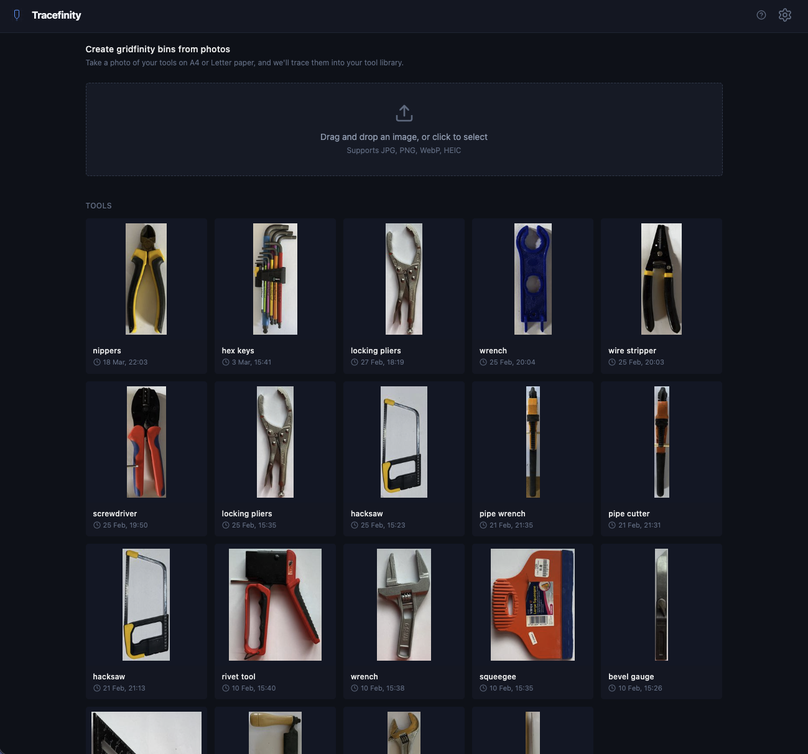
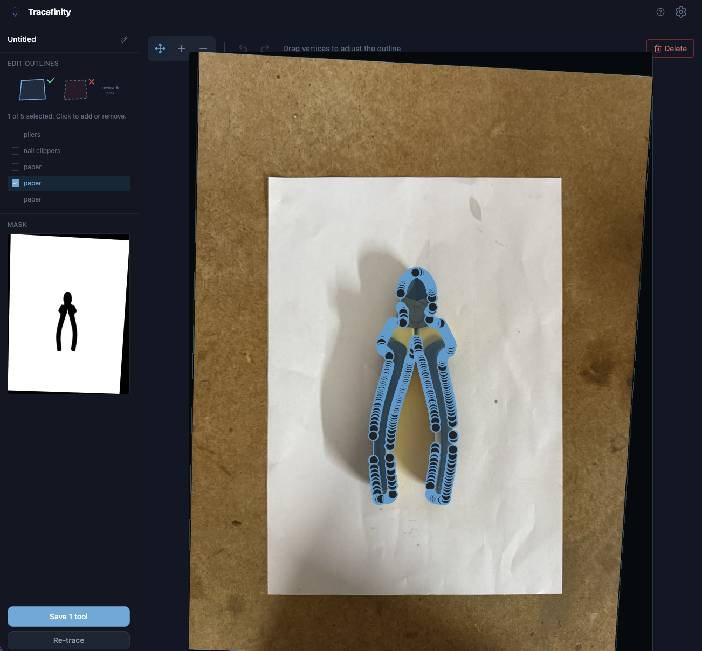
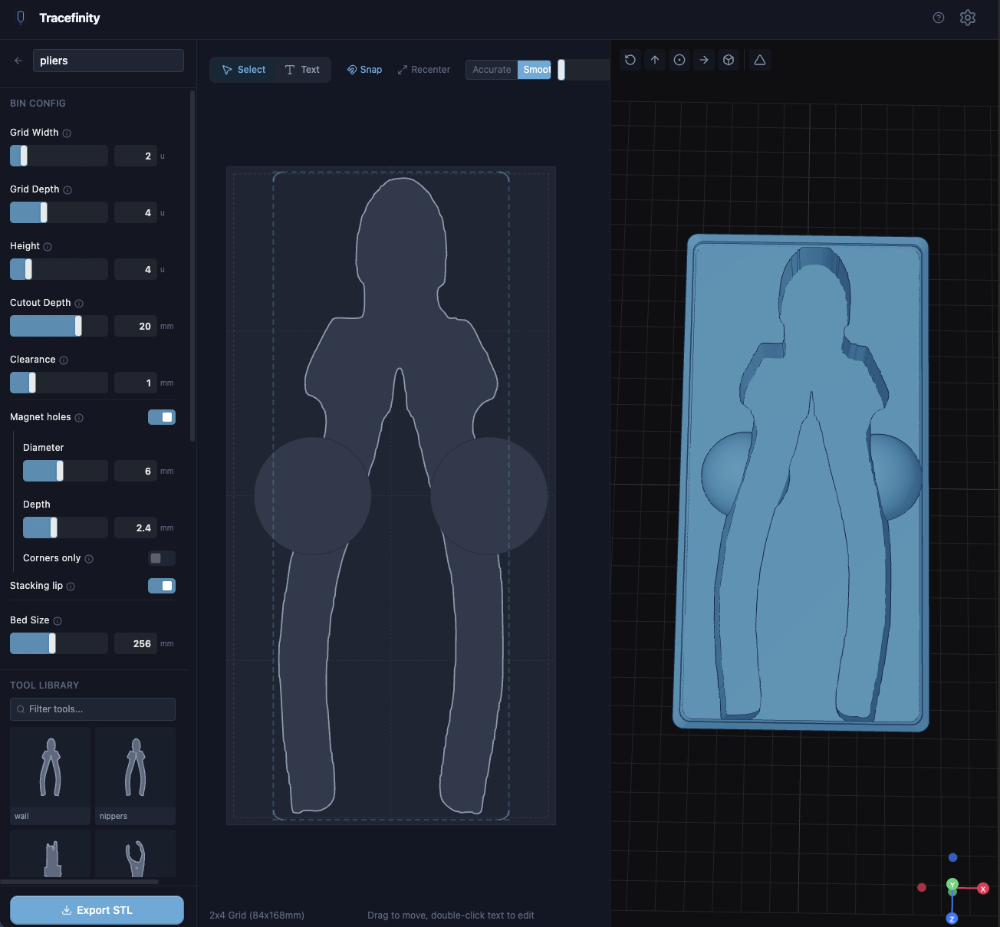

<p align="center">
  
</p>

<p align="center">
  <a href="https://github.com/tracefinity/tracefinity/releases"></a>
  <a href="https://github.com/tracefinity/tracefinity/actions"></a>
  <a href="https://github.com/tracefinity/tracefinity/pkgs/container/tracefinity"></a>
  <a href="https://github.com/tracefinity/tracefinity/blob/main/LICENSE"></a>
</p>

<p align="center">Generate custom <a href="https://gridfinity.xyz/">gridfinity</a> bins from photos of your tools.</p>

## How It Works

1. Place tools on A4/Letter paper (portrait or landscape)
2. Take a photo from above
3. Upload and adjust paper corners for scale calibration
4. AI traces tool outlines automatically
5. Save traced tools to your library
6. Create bins, add tools from the library, arrange the layout
7. Download STL/3MF for 3D printing

[Demo video](docs/tracefinity-demo.mp4)





## Quick Start

Try it at [tracefinity.net](https://tracefinity.net) without installing anything, or self-host:

### Docker

```bash
# local model (no API key needed)
docker run -p 3000:3000 -v ./data:/app/storage ghcr.io/tracefinity/tracefinity

# or with Gemini API
docker run -p 3000:3000 -v ./data:/app/storage -e GOOGLE_API_KEY=your-key ghcr.io/tracefinity/tracefinity
```

Open http://localhost:3000

By default, Tracefinity uses a local [InSPyReNet](https://github.com/plemeri/InSPyReNet) model for tracing -- no API key needed. Set `GOOGLE_API_KEY` to use Gemini instead for higher accuracy on complex tools.

| Variable | Default | Description |
|-|-|-|
| `GOOGLE_API_KEY` | | Gemini API key. When set, uses Gemini instead of the local model |
| `GEMINI_IMAGE_MODEL` | `gemini-3.1-flash-image-preview` | Gemini model for mask generation (see below) |

### From Source

Prerequisites: Python 3.11+, Node.js 20+

```bash
git clone https://github.com/tracefinity/tracefinity
cd tracefinity

# First time setup
cd backend && python3 -m venv venv && source venv/bin/activate && pip install -r requirements.txt
cd ../frontend && npm install
cd ..

# Run (starts backend on :8000 and frontend on :4001)
make dev
```

Open http://localhost:4001

## Tracing Modes

Tracefinity supports three ways to trace tool outlines from photos. All three produce the same output -- black and white mask images that get converted to editable polygons via OpenCV contour extraction.

### Local model (default)

When no API key is configured, Tracefinity uses [InSPyReNet](https://github.com/plemeri/InSPyReNet), a background removal model that runs entirely on your machine. No API key, no network access, no cost.

Model weights (~80MB) download automatically on first trace.

| | |
|-|-|
| Speed | ~0.7s on Apple Silicon (MPS), ~2-3s on CPU |
| Quality | Matches Gemini on ~70% of images (0.95 median IoU) |
| Hardware | Any machine with Python. GPU optional but recommended |
| Best for | Well-lit tools on clean white paper |
| Struggles with | Highly reflective/metallic tools, poor lighting, cluttered backgrounds |

InSPyReNet is a salient object detection model trained to separate foreground objects from backgrounds. It works well for our use case because tools on white paper is a near-ideal foreground/background split. The model runs on Apple Silicon via MPS (Metal Performance Shaders) or on CPU via PyTorch.

We evaluated several local approaches before settling on InSPyReNet:

| Approach | Result |
|-|-|
| InSPyReNet | 69% of images >0.9 IoU vs Gemini. Fast, consistent, no prompting needed |
| ISNet (rembg) | Close second at 62% >0.9 IoU, slightly slower |
| SAM2 (ultralytics) | Excellent when it works (0.92+ IoU) but bimodal -- 39% >0.9, 50% complete failure. Needs careful prompting |
| U2Net (rembg) | Decent at 60% >0.7 but only 20% >0.9 |
| FastSAM | Poor quality (7% >0.9) |
| Ollama VLMs | Can't generate images. Vertex extraction gives wrong coordinates |

### Gemini API

Set `GOOGLE_API_KEY` to use Google's Gemini image generation models. Gemini can both understand photos and generate clean silhouette masks, which gives it an edge on complex tools with reflections, shadows, or low contrast against the paper.

To get an API key: [Google AI Studio](https://aistudio.google.com/apikey) (free tier available).

| | |
|-|-|
| Speed | 2-5s (network round trip) |
| Quality | Best overall, especially on complex/reflective tools |
| Cost | Free tier available, then pay per image |
| Best for | Metallic tools, complex shapes, challenging lighting |

Set `GEMINI_IMAGE_MODEL` to choose which model generates masks:

| Model | Pros | Cons |
|-|-|-|
| `gemini-3.1-flash-image-preview` (default) | Fast, good mask quality | Preview model |
| `gemini-3-pro-image-preview` | Best mask quality, pixel-accurate alignment | Slower, preview model |
| `gemini-2.5-flash-image` | Faster, cheaper, GA | Returns arbitrary dimensions, needs post-hoc alignment |

### Manual mask upload

No API key and prefer not to use the local model? Upload a mask manually:

1. Upload your photo and set paper corners
2. Click "Manual" and download the corrected image
3. Open [Gemini](https://gemini.google.com) and paste the image with the provided prompt
4. Download the generated mask (black tools on white background)
5. Upload the mask back to Tracefinity

## Features

- **AI-powered tracing** -- Local model or Gemini generates accurate tool silhouettes from photos
- **Manual mask upload** -- Use the Gemini web interface without an API key
- **Selective saving** -- Choose which traced outlines to keep before saving to your library
- **Tool library** -- Save traced tools and reuse them across multiple bins
- **Tool editor** -- Rotate tools, add/remove vertices, adjust outlines, snap to grid
- **Smooth or accurate** -- Toggle Chaikin subdivision for smooth curves, or keep the raw trace; SVG and STL exports both respect this
- **Finger holes** -- Circular, square, or rectangular cutouts for easy tool removal
- **Interior rings** -- Hollow tools (e.g. spanners) traced correctly with holes preserved
- **Bin builder** -- Drag and arrange tools with snap-to-grid, auto-sizing to fit the gridfinity grid
- **Cutout clearance** -- Configurable tolerance so tools fit without being too loose
- **Text labels** -- Recessed or embossed text on bins
- **Gridfinity compatible** -- Proper base profile, magnet holes, stacking lip
- **Live 3D preview** -- See your bin in three.js before printing
- **STL and 3MF export** -- 3MF supports multi-colour printing for embossed text
- **SVG export** -- Individual tool outlines as SVG, with smoothing applied
- **Bed splitting** -- Large bins auto-split into printable pieces with diagonal fit detection
- **Landscape and portrait** -- Paper orientation auto-detected from corner positions
- **Single-container Docker** -- Frontend and backend in one image, data in a single volume

## What is Gridfinity?

[Gridfinity](https://gridfinity.xyz/) is a modular storage system designed by [Zack Freedman](https://www.youtube.com/watch?v=ra_9zU-mnl8). Bins snap into baseplates on a 42mm grid, making it easy to organise tools, components, and supplies. The system is open source and hugely popular in the 3D printing community.

## Licence

MIT
