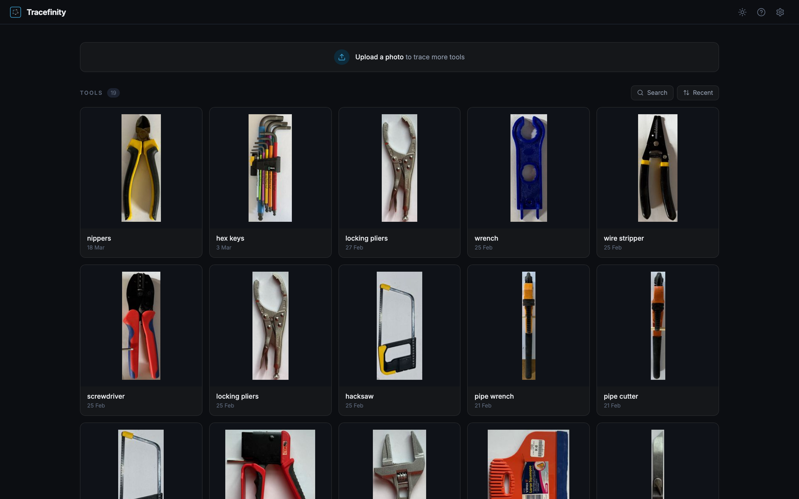
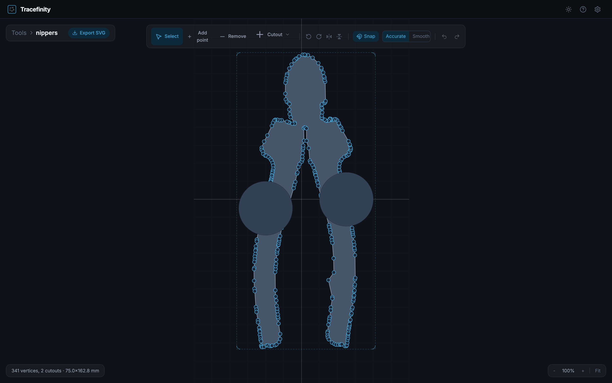
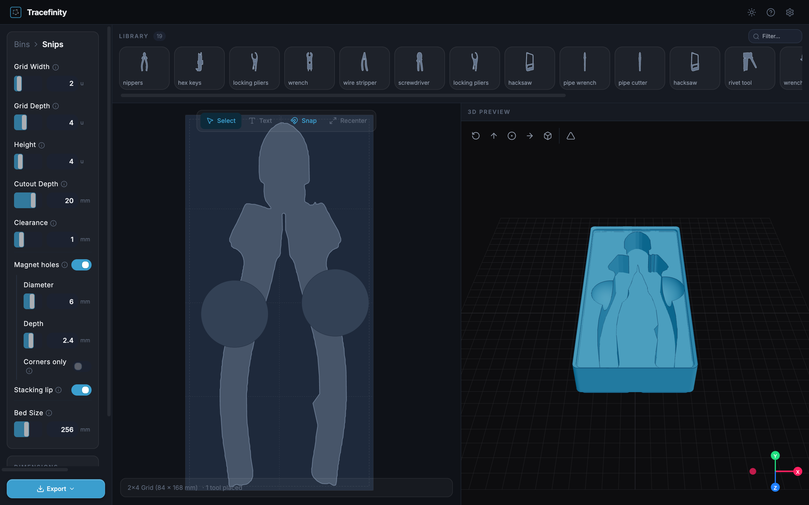

<p align="center">
  
</p>

<p align="center">
  <a href="https://github.com/tracefinity/tracefinity/releases"></a>
  <a href="https://github.com/tracefinity/tracefinity/actions"></a>
  <a href="https://github.com/tracefinity/tracefinity/pkgs/container/tracefinity"></a>
  <a href="https://github.com/tracefinity/tracefinity/blob/main/LICENSE"></a>
</p>

<p align="center">Generate custom <a href="https://gridfinity.xyz/">gridfinity</a> bins from photos of your tools.</p>

## How It Works

1. Place tools on A4, Letter, A3, or Tabloid paper (tools can overflow the edges)
2. Take a photo from above
3. Upload and adjust paper corners for scale calibration
4. AI traces tool outlines automatically
5. Save traced tools to your library
6. Group tools into projects when planning a drawer or workspace
7. Create bins from project tools, arrange the layout
8. Download STL/3MF for 3D printing

| Dashboard | Tool Editor | Bin Editor |
|-|-|-|
|  |  |  |

## Quick Start

Try it at [tracefinity.net](https://tracefinity.net) without installing anything, or self-host:

### Docker

```bash
# local model (no API key needed)
docker run -p 3000:3000 -v ./data:/app/storage ghcr.io/tracefinity/tracefinity

# or with Gemini API
docker run -p 3000:3000 -v ./data:/app/storage -e GOOGLE_API_KEY=your-key ghcr.io/tracefinity/tracefinity

# remote saliency via fal.ai
docker run -p 3000:3000 -v ./data:/app/storage -e FAL_KEY=your-key ghcr.io/tracefinity/tracefinity

# remote saliency via Replicate
docker run -p 3000:3000 -v ./data:/app/storage -e REPLICATE_API_TOKEN=your-token ghcr.io/tracefinity/tracefinity

# run as your host user (files in ./data owned by you, not root)
docker run -p 3000:3000 -v ./data:/app/storage --user "$(id -u):$(id -g)" ghcr.io/tracefinity/tracefinity
```

With a remote provider the corrected paper crop is sent to that provider for masking. fal is called with `sync_mode`, so the result is not kept in request history; Replicate API predictions (including the input image) auto-purge after about an hour, which is the only retention control Replicate exposes (it has no API to delete them sooner).

The Docker image supports **linux/amd64** and **linux/arm64**. Apple Silicon Macs run arm64 natively via Docker Desktop. ARM devices need at least 2GB RAM (for U2-Net paper detection), so a Raspberry Pi 4/5 with 4GB+ works.

Open http://localhost:3000

By default, Tracefinity uses [IS-Net](https://github.com/xuebinqin/DIS) for local tracing -- no API key needed. Set `GOOGLE_API_KEY` to use Gemini instead. See [Tracing Modes](#tracing-modes) for RAM requirements per model.

| Variable | Default | Description |
|-|-|-|
| `GOOGLE_API_KEY` | | Gemini API key. Uses Gemini instead of local models |
| `TRACERS` | auto-detected | Comma-separated list of available tracers, e.g. `gemini,birefnet-lite,isnet` |
| `TRACEFINITY_ONNX_PROVIDER` | `auto` | Local ONNX provider: `auto`, `cuda`, or `cpu` |
| `GEMINI_IMAGE_MODEL` | `gemini-3.1-flash-image-preview` | Gemini model for mask generation (see below) |
| `TOOL_LABEL_PROVIDER` | `none` | Optional automatic tool naming. Set to `ollama` for local vision naming |
| `SHOW_APP_VERSION` | `true` | Show the running version in the settings popover. Set to `false` to hide it |

### Docker Compose

```yaml
services:
  tracefinity:
    image: ghcr.io/tracefinity/tracefinity
    ports:
      - "3000:3000"
    volumes:
      - ./data:/app/storage
    environment:
      GOOGLE_API_KEY: your-key  # optional, omit to use local model
    restart: unless-stopped
```

```bash
docker compose up -d
```

Open http://localhost:3000

### Kubernetes (Helm)

```bash
helm registry login ghcr.io --username <your-github-username> --password <your-github-token>

helm install tracefinity oci://ghcr.io/tracefinity/charts/tracefinity \
  --namespace tracefinity \
  --create-namespace \
  --set persistence.enabled=true \
  --set persistence.size=5Gi
```

To use Gemini instead of the local model:

```bash
helm install tracefinity oci://ghcr.io/tracefinity/charts/tracefinity \
  --namespace tracefinity \
  --create-namespace \
  --set persistence.enabled=true \
  --set persistence.size=5Gi \
  --set env.GOOGLE_API_KEY=your-key
```

Or with a `values.yaml`:

```yaml
persistence:
  enabled: true
  size: 5Gi

env:
  GOOGLE_API_KEY: your-key
```

```bash
helm install tracefinity oci://ghcr.io/tracefinity/charts/tracefinity \
  --namespace tracefinity \
  --create-namespace \
  -f values.yaml
```

> **Note:** The local tracing models load at startup and require at least 2GB of memory. Set resource limits accordingly — see [Tracing Modes](#tracing-modes) for per-model RAM requirements.

### From Source

Prerequisites: Python 3.11+, Node.js 20+, [pnpm](https://pnpm.io/installation)

```bash
git clone https://github.com/tracefinity/tracefinity
cd tracefinity

# First time setup
cd backend && python3 -m venv venv && source venv/bin/activate && pip install -r requirements.txt
cd ../frontend && pnpm install
cd ..

# Run (starts backend on :8000 and frontend on :4001)
make dev
```

Open http://localhost:4001

## Tracing Modes

Tracefinity supports three ways to trace tool outlines from photos. All three produce the same output -- black and white mask images that get converted to editable polygons via OpenCV contour extraction.

### Local models (default)

When no API key is configured, Tracefinity runs a local salient object detection model. No API key, no network access, no cost. Model weights download automatically on first trace. Three CPU-friendly models are available by default, selectable via the `TRACERS` env var or the UI dropdown:

| Model | Speed (CPU) | Min RAM | Quality | Notes |
|-|-|-|-|-|
| [IS-Net](https://github.com/xuebinqin/DIS) (default) | ~0.8s | 2GB | Good | Fastest, lowest memory |
| [BiRefNet Lite](https://github.com/ZhengPeng7/BiRefNet) | ~3.6s | 8GB | Best | Handles reflections and shiny surfaces well |
| [InSPyReNet](https://github.com/plemeri/InSPyReNet) | ~2.8s | 6GB | Good | Apple Silicon (MPS) support |

Paper corner detection runs [U2-Net Portable](https://github.com/xuebinqin/U-2-Net) alongside the tracer. RAM figures include both models. All models load at startup. All local models require ONNX Runtime, which needs **AVX** CPU instructions. On non-AVX CPUs (some older VMs, Atoms), U2-Net is skipped (paper detection falls back to OpenCV-only, less accurate) and local tracers are unavailable. Remote tracers (Gemini, Replicate, fal) work regardless.

**Minimum RAM: 2GB** (IS-Net). BiRefNet Lite needs **8GB**. See [Resource Requirements](docs/resource-requirements.md) for full details including Docker memory limits and platform support.

#### Optional: NVIDIA CUDA acceleration

All local models run on CPU by default. No GPU needed.

If you have an NVIDIA GPU with CUDA, you can optionally enable GPU acceleration
for faster inference. Install the GPU requirements after the default backend
requirements, set `TRACERS=birefnet-general,birefnet-lite,isnet`, and set
`TRACEFINITY_ONNX_PROVIDER=cuda`:

```bash
pip install -r backend/requirements.txt -r backend/requirements-gpu.txt
```

This uses ONNX Runtime GPU for the `rembg` models (`isnet`, `birefnet-lite`,
`birefnet-general`) and avoids PyTorch CUDA for those tracers. Intel Arc and
AMD ROCm GPUs are not supported.

See [#21](https://github.com/tracefinity/tracefinity/issues/21) for the benchmark that led to this selection.

### Automatic tool names

Set `TOOL_LABEL_PROVIDER=ollama` to have a local Ollama vision model suggest names for traced polygons before you save them to the tool library. Naming is disabled by default and falls back to generic names whenever it is unavailable.

See [Automatic Tool Naming](docs/tool-naming.md) for setup and configuration.

### Gemini API

Set `GOOGLE_API_KEY` to use Google's Gemini models instead. Higher accuracy overall, especially on complex or reflective tools. To get a key: [Google AI Studio](https://aistudio.google.com/apikey) (free tier available).

| Model | Pros | Cons |
|-|-|-|
| `gemini-3.1-flash-image-preview` (default) | Fast, good mask quality | Preview model |
| `gemini-3-pro-image-preview` | Best mask quality, pixel-accurate alignment | Slower, preview model |
| `gemini-2.5-flash-image` | Faster, cheaper, GA | Returns arbitrary dimensions, needs post-hoc alignment |

### Manual mask upload

No API key and prefer not to use the local model? Upload a mask manually:

1. Upload your photo and set paper corners
2. Click "Manual" and download the corrected image
3. Open [Gemini](https://gemini.google.com) and paste the image with the provided prompt
4. Download the generated mask (black tools on white background)
5. Upload the mask back to Tracefinity

## Features

- **AI-powered tracing** -- Local model or Gemini generates accurate tool silhouettes from photos
- **Manual mask upload** -- Use the Gemini web interface without an API key
- **Selective saving** -- Choose which traced outlines to keep before saving to your library
- **Tool library** -- Save traced tools and reuse them across multiple bins
- **Bin projects** -- Plan a group of tools and bins together, track which tools still need bins, and create project-scoped bins
- **Tool editor** -- Rotate tools, add/remove vertices, adjust outlines, snap to grid
- **Smooth or accurate** -- Toggle Chaikin subdivision for smooth curves, or keep the raw trace; SVG and STL exports both respect this
- **Finger holes** -- Circular, square, or rectangular cutouts for easy tool removal
- **Interior rings** -- Hollow tools (e.g. spanners) traced correctly with holes preserved
- **Bin builder** -- Drag and arrange tools with snap-to-grid, auto-sizing to fit the gridfinity grid
- **Cutout clearance** -- Configurable tolerance so tools fit without being too loose
- **Cutout chamfer** -- Bevelled top edges on tool pockets for easy tool insertion
- **Contrast insert** -- Generate a separate STL for printing tool silhouettes in a different colour
- **Text labels** -- Recessed or embossed text on bins
- **Gridfinity compatible** -- Proper base profile, magnet holes, stacking lip
- **Live 3D preview** -- See your bin in three.js before printing
- **STL and 3MF export** -- 3MF supports multi-colour printing for embossed text
- **SVG export** -- Individual tool outlines as SVG, with smoothing applied
- **Bed splitting** -- Large bins auto-split into printable pieces with diagonal fit detection
- **Landscape and portrait** -- Paper orientation auto-detected from corner positions
- **Single-container Docker** -- Frontend and backend in one image, data in a single volume

## Guides

Step-by-step usage guides covering each part of the workflow:

- [Getting started](docs/usage/getting-started.md)
- [Uploading photos](docs/usage/uploading-photos.md)
- [Tracing](docs/usage/tracing.md)
- [Tool editor](docs/usage/tool-editor.md)
- [Tool library](docs/usage/tool-library.md)
- [Bin configuration](docs/usage/bin-configuration.md)
- [Bin layout](docs/usage/bin-layout.md)
- [Projects](docs/usage/projects.md)
- [Exporting](docs/usage/exporting.md)
- [Automatic tool naming](docs/tool-naming.md)
- [Keyboard shortcuts](docs/usage/keyboard-shortcuts.md)
- [Backup and restore](docs/usage/backups.md)

## What is Gridfinity?

[Gridfinity](https://gridfinity.xyz/) is a modular storage system designed by [Zack Freedman](https://www.youtube.com/watch?v=ra_9zU-mnl8). Bins snap into baseplates on a 42mm grid, making it easy to organise tools, components, and supplies. The system is open source and hugely popular in the 3D printing community.

## Licence

MIT
